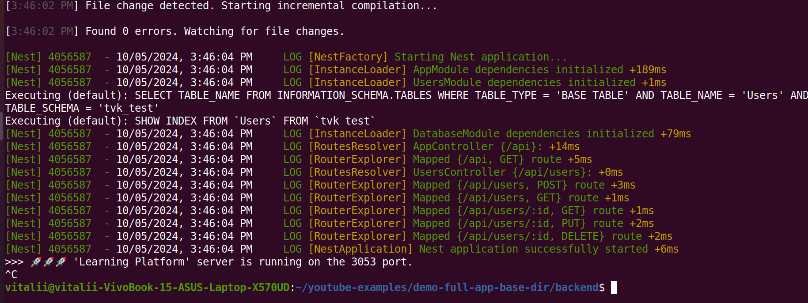

<p align="center">
  <a href="http://nestjs.com/" target="blank"></a>
</p>

[circleci-image]: https://img.shields.io/circleci/build/github/nestjs/nest/master?token=abc123def456
[circleci-url]: https://circleci.com/gh/nestjs/nest

  <p align="center">A progressive <a href="http://nodejs.org" target="_blank">Node.js</a> framework for building efficient and scalable server-side applications.</p>
    <p align="center">

  <!--[](https://opencollective.com/nest#backer)
  [](https://opencollective.com/nest#sponsor)-->

## General Description

[Nest](https://github.com/nestjs/nest) framework TypeScript starter repository.

## My FULL DEMO COURSE Description

Brick by brick instruction: RESTful APIs with Node.js, Sequelize, TypeScript, and Mysql. Learn to efficiently manage App server side.
!!!_(If you want to work only with server logic, you can switch to "backend" branch and run the server separately)_

To start the server part of the application, you need to perform the following steps:

### 1. Installation of all necessary packages

Command for instalation packages

```bash
$ npm install
```
### 2. Server Configuration Guide

Follow these steps to set up your server configuration:

#### Step 1: Copy the Configuration Template file

1. **Locate the Template File**

   Find the file named `.env-example.txt` in the backend/ directoryt.

2. **Create a Copy**

   Make a copy of `.env-example.txt` and rename it to `.env`.

#### Step 2: Update Configuration Values

1. **Open `config.json`**

   Find and replace all config DB/App placeholder values using you local/remote.

2. **Ensure Database is Running**

   Confirm that your database server is up and running

### 3 Running the app

Prefer dev mode for the debaging/developing

```bash
# watch mode
$ npm run start:dev
```

**If you did everything correctly, you should see a log about "successful server start" as in the screenshot**
<p align="center">
  
</p>

- URL: [http://localhost:3053/](http://localhost:3053/)
_(based on the PORT env from the env file)_

If u want to start server in PROD mode 

```bash
# development
$ npm run start

# production mode
$ npm run start:prod
```

## License

Nest is [MIT licensed](LICENSE).

## Stay in touch

Feel free to explore the project, contribute, or reach out if you have any questions. Happy studying!

- Author - [Senior AQA: Mykhailiuk Vitaliy](vmykhailiuk.chanel@gmail.com)

